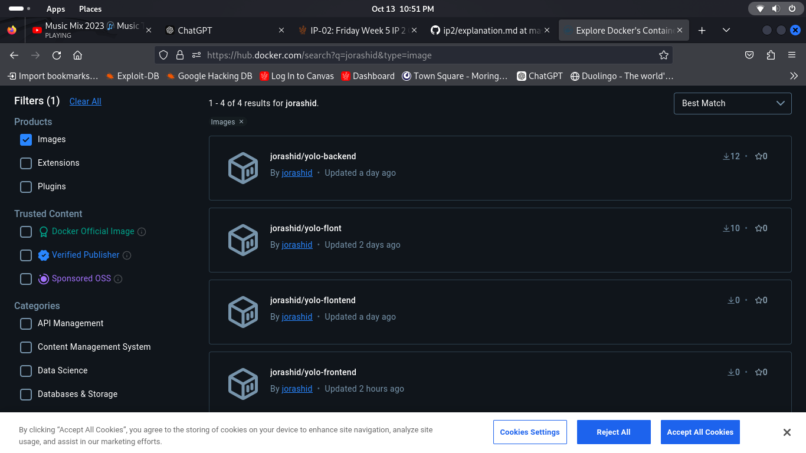

Explanation of Docker Implementation
1. Choice of the Base Image on Which to Build Each Container
Frontend

The frontend Dockerfile uses node:14-alpine as the base image. The Alpine variant is chosen for its lightweight nature, which minimizes the final image size. Node.js version 14 is selected to ensure compatibility with the libraries and dependencies used in the frontend application.
Backend

For the backend Dockerfile, node:18-alpine is used. This base image offers a more recent version of Node.js, allowing for better performance and access to the latest features. Again, the Alpine variant is selected for its efficiency and smaller footprint.
2. Dockerfile Directives Used in the Creation and Running of Each Container
Frontend Dockerfile

    FROM: Specifies the base image for the build stage and the final runtime stage.
    WORKDIR: Sets the working directory within the container.
    COPY: Copies files from the local machine to the container.
    RUN: Executes commands during the image build process (e.g., installing dependencies).
    EXPOSE: Documents the port the application will listen on at runtime.
    CMD: Specifies the command to run when the container starts.

Backend Dockerfile

    The directives are similar to the frontend but include RUN npm install --omit=dev to install only production dependencies, which reduces the image size.

3. Docker-compose Networking
Application Port Allocation

    The frontend service (yolo-client) maps port 3000 on the host to port 3000 in the container, allowing external access to the frontend application.
    The backend service (yolo-backend) maps port 5000 on the host to port 5000 in the container for accessing the backend API.

Bridge Network Implementation

    A custom bridge network (yolo-net) is defined in the docker-compose.yml. This allows both services to communicate with each other seamlessly without exposing their internal communication ports to the host network.

4. Docker-compose Volume Definition and Usage

A named volume (app-mongo-data) is created to persist data from the backend service. This volume is mounted to /app/data in the container, ensuring that data remains consistent across container restarts and allows for easier data management.
5. Git Workflow Used to Achieve the Task

    Branching: A feature branch was created for developing the Docker implementation.
    Commits: Changes were committed with clear, descriptive messages to track progress.
    Pull Requests: Once development was complete, a pull request was created to merge the feature branch into the main branch, allowing for code review and discussion.

6. Successful Running of the Applications and Debugging Measures Applied

    Upon running docker-compose up, both services started successfully. The frontend was accessible on port 3000, while the backend responded on port 5000.
    In case of issues, the docker-compose logs command was utilized to inspect container logs for errors, and docker ps was used to check the running containers.

7. Good Practices: Docker Image Tag Naming Standards

    Images are tagged with a version number (e.g., v1.0.6 for the frontend and v1.0.0 for the backend). This versioning helps in identifying specific releases and managing updates.
    Following semantic versioning standards ensures clarity and consistency in image management.

8. Screenshot of Deployed Image on DockerHub

Note: Replace  with the actual URL where the screenshot can be found.
